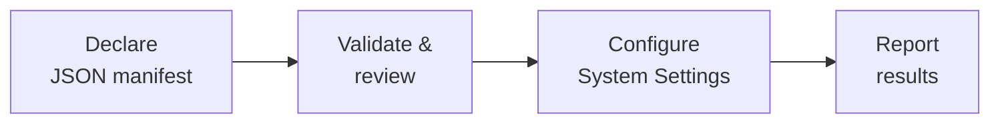

<p align="center">
  
</p>

<h1 align="center">Permstrap</h1>

<p align="center">
  <strong>Declare the access your Mac tools need. Review it once. Let System Settings do the rest.</strong>
  <br />
  Bootstrap macOS Privacy &amp; Security permissions for applications and executables
  from a reviewable JSON manifest.
</p>

<p align="center">
  <a href="#requirements"></a>
  <a href="#requirements"></a>
  <a href="#build"></a>
  <a href="#build"></a>
  <a href="#build"></a>
  
</p>

---

> [!IMPORTANT]
> Permstrap does not bypass macOS Transparency, Consent, and Control (TCC). After you
> review the plan, it automates the same System Settings controls you would use
> by hand. ****It never edits `TCC.db`, disables SIP, or requires MDM****.

## How it works

Declare trusted apps, executables, and permissions in `PermissionTargets.json`.
Permstrap validates and resolves them, shows the complete plan for confirmation, then
drives System Settings through the macOS Accessibility API. Actions are sent directly
to the target process without deliberately stealing focus. Existing permissions are
left alone; missing entries are added by an automatic native file drop that System
Settings validates. That short drop temporarily moves the real pointer and restores
its original position; ordinary Accessibility operations do not move it. Permstrap
targets the permission list directly and never opens the application picker.



The result is local, repeatable permission-as-code with a human review step and
macOS's own interface still in the loop.

Accessibility actions are preferred because they work with many inactive windows. If
a control exposes no usable action, Permstrap can fall back to a mouse event posted to
that process with `CGEventPostToPid`. Individual applications may still reject
background input, and secure fields and authorization dialogs keep their existing
verified handling. The one-time setup requests both Accessibility client access and
the event-posting grant macOS uses for the automatic native drop.

## Supported permissions

| Identifier         | Permission                        | Admin |
| ------------------ | --------------------------------- | :---: |
| `accessibility`    | Accessibility                     |  Yes  |
| `input-monitoring` | Input Monitoring                  |  Yes  |
| `full-disk-access` | Full Disk Access                  |  Yes  |
| `screen-recording` | Screen & System Audio Recording   |  Yes  |
| `developer-tools`  | Developer Tools                   |  Yes  |
| `bluetooth`        | Bluetooth                         |  Yes  |
| `media-library`    | Media & Apple Music               |  Yes  |
| `app-management`   | App Management                    |  Yes  |
| `automation`       | Existing Automation relationships |  No   |

> [!NOTE]
> macOS creates Automation relationships only after an application requests control of
> another application. Permstrap can enable existing relationships, but it cannot create
> one that macOS has never observed.

## Quick start

1. Open Permstrap and choose or create `PermissionTargets.json`.
2. Grant Permstrap Accessibility once.
3. Enter and validate the administrator password.
4. Review the resolved targets and permissions.
5. Select **Grant Permissions** and follow the live status.

Required missing targets stop the plan; optional ones are skipped. In the editor,
**Save…** writes only, **Apply** uses changes now, and **Save & Apply…** does both.
Successful actions also update the app-managed copy loaded on next launch. Applying
never skips review.

## Manifest

Create `PermissionTargets.json` in the app by choosing **New…** beside Permission
Targets, adding applications or executables, and selecting the permissions for each
target. You can also write the file by hand and load it with **Open…** or
`--targets`. Start from the complete
[`example manifest`](examples/PermissionTargets.json), and use the
[`JSON Schema`](resources/PermissionTargets.schema.json) as the field reference:

```json
{
  "version": 1,
  "defaults": {
    "permissions": { "sets": ["developer-tool"] }
  },
  "targets": [
    {
      "id": "macos:terminal",
      "name": "Terminal",
      "required": true,
      "bundleIdentifiers": ["com.apple.Terminal"]
    },
    {
      "id": "macos:osascript",
      "name": "AppleScript Interpreter",
      "kind": "executable",
      "pathCandidates": ["/usr/bin/osascript"],
      "permissions": {
        "inheritDefaults": false,
        "include": ["accessibility"]
      }
    }
  ]
}
```

Use `required` to fail on a missing target, `enabled` to retain but skip one, and
`kind: "executable"` for binaries. Permission `sets` expand common groups;
`include`, `exclude`, and `inheritDefaults` refine them.

System Settings roles, interaction geometry, activation retries, and workflow timing
are declared in
[`RuntimePolicy.json`](resources/policy/RuntimePolicy.json) and rejected if the
configuration is incomplete, unknown, duplicated, or out of range.

## Security model

The administrator password is held in libsodium locked memory, validated with
Authorization Services, zeroed after use, and never shared with the login session.
Permstrap refuses to run if memory locking fails.

Before submitting credentials, it verifies that each prompt is new, foreground,
Apple-signed, and matches the expected process, path, text, and secure field. Each
authorization operation is bounded and disarmed afterward. See the
[`runtime policy`](resources/policy/RuntimePolicy.json).

> [!CAUTION]
> A literal `--password` may briefly appear in shell history or process inspection.
> Prefer the graphical password field.

## Requirements

- Apple Silicon Mac (`arm64`)
- macOS 26.0 or newer
- An administrator account and password
- Accessibility permission for Permstrap itself

The bundled runtime policy currently targets the English System Settings and
authorization UI.

## Build

Using the pinned Nix environment:

```sh
nix develop
just verify
open build/Permstrap.app
```

Without Nix, install Xcode 26, Meson 1.11+, Ninja, and `just`:

```sh
meson setup build
meson compile -C build
meson test -C build --print-errorlogs
```

For a stripped, hardened production bundle:

```sh
just release
open release/Permstrap.app
```

Releases are ad-hoc signed unless `CODESIGN_IDENTITY` names a Developer ID identity.

## CLI

```sh
open build/Permstrap.app --args --help
```

| Option                  | Purpose                                    |
| ----------------------- | ------------------------------------------ |
| `--targets PATH`        | Preload a target document                  |
| `--runtime-policy PATH` | Validate and use another runtime policy    |
| `--password PASSWORD`   | Preload a literal password; prefer the GUI |
| `--self-check`          | Validate runtime configuration and exit    |
| `--dump-ax PID`         | Print a process's Accessibility tree       |
| `--verify-agent PID`    | Verify an authorization agent              |
| `-V`, `--version`       | Print the version                          |
| `-h`, `--help`          | Print help                                 |

```sh
open build/Permstrap.app --args \
  --targets "$PWD/examples/PermissionTargets.json"
```

Always launch with `open`; invoking the inner executable directly can prevent macOS
from applying the bundle's entitlements and permissions correctly.

## Development

```sh
just verify
just verify-matrix
just format
```

## License

Permstrap is available under the [MIT License](LICENSE).
